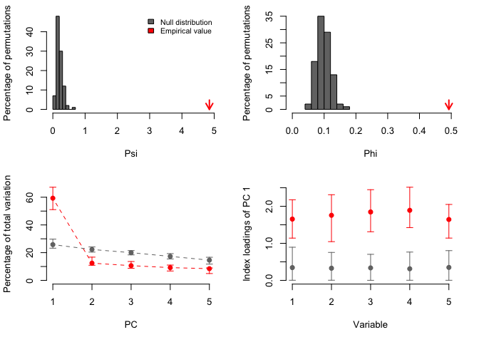

<!-- README.md is generated from README.Rmd. Please edit that file -->

# PCAtest

<!-- badges: start -->
<!-- badges: end -->

The goal of PCAtest is to evaluate the overall significance of a PCA, of
each PC axis, and of the contributions of each observed variable to the
significant axes based on permutation-based statistical tests. PCAtest
uses random permutations to build null distributions for several
statistics of a PCAanalysis: Psi (Vieira 2012),Phi (Gleason and Staelin
1975), the rank-of-roots (ter Braak 1988), the index of the loadings
(Vieira 2012), and the correlations of the PC with the variables
(Jackson 1991). Comparing these distributions with the observed values
of the statistics, the function tests: (1) the hypothesis that there is
more correlational structure among the observed variables than expected
by random chance, (2) the statistical significance of each PC, and (3)
the contribution of each observed variable to each significant PC. The
function also calculates the sampling variance around mean observed
statistics based on bootstrap replicates.

## Installation

You can install the released and the development versions from
\[GitHub\] (<https://github.com/>) with:

``` r
# install.packages("devtools")
devtools::install_github("arleyc/PCAtest")
```

## Examples

``` r
library(PCAtest)
# PCA analysis of five uncorrelated variables
data("ex0")
result<-PCAtest(ex0, 100, 100, 0.05, varcorr=FALSE, counter=FALSE, plot=TRUE)
#> 
#> Sampling bootstrap replicates... Please wait
#> 
#> Calculating confidence intervals of empirical statistics... Please wait
#> 
#> Sampling random permutations... Please wait
#> 
#> Comparing empirical statistics with their null distributions... Please wait
#> 
#> ========================================================
#> Test of PCA significance: 5 variables, 100 observations
#> 100 bootstrap replicates, 100 random permutations
#> ========================================================
#> 
#> Empirical Psi = 0.1691, Max null Psi = 0.4885, Min null Psi = 0.0598, p-value = 0.66
#> Empirical Phi = 0.0920, Max null Phi = 0.1563, Min null Phi = 0.0547, p-value = 0.66
#> 
#> PCA is not significant!
```


``` r
#PCA analysis of five correlated (r=0.5) variables
data("ex05")
result<-PCAtest(ex05, 100, 100, 0.05, varcorr=FALSE, counter=FALSE, plot=TRUE)
#> 
#> Sampling bootstrap replicates... Please wait
#> 
#> Calculating confidence intervals of empirical statistics... Please wait
#> 
#> Sampling random permutations... Please wait
#> 
#> Comparing empirical statistics with their null distributions... Please wait
#> 
#> ========================================================
#> Test of PCA significance: 5 variables, 100 observations
#> 100 bootstrap replicates, 100 random permutations
#> ========================================================
#> 
#> Empirical Psi = 5.4655, Max null Psi = 0.4888, Min null Psi = 0.0366, p-value = 0
#> Empirical Phi = 0.5228, Max null Phi = 0.1563, Min null Phi = 0.0428, p-value = 0
#> 
#> Empirical eigenvalue #1 = 3.08098, Max null eigenvalue = 1.49515, p-value = 0
#> Empirical eigenvalue #2 = 0.63526, Max null eigenvalue = 1.25543, p-value = 1
#> Empirical eigenvalue #3 = 0.52603, Max null eigenvalue = 1.10212, p-value = 1
#> Empirical eigenvalue #4 = 0.43234, Max null eigenvalue = 0.9713, p-value = 1
#> Empirical eigenvalue #5 = 0.3254, Max null eigenvalue = 0.87495, p-value = 1
#> 
#> PC 1 is significant and accounts for 61.6% (95%-CI:54.2-68.4) of the total variation
#> 
#> Variables 1, 2, 3, 4, and 5 have significant loadings on PC 1
```


``` r
#PCA analysis of five correlated (r=1) variables
v1<-seq(0,1,0.01)
v5=v4=v3=v2=v1
ex1<-cbind(v1,v2,v3,v4,v5)
result<-PCAtest(ex1, 100, 100, 0.05, varcorr=FALSE, counter=FALSE, plot=TRUE)
#> 
#> Sampling bootstrap replicates... Please wait
#> 
#> Calculating confidence intervals of empirical statistics... Please wait
#> 
#> Sampling random permutations... Please wait
#> 
#> Comparing empirical statistics with their null distributions... Please wait
#> 
#> ========================================================
#> Test of PCA significance: 5 variables, 101 observations
#> 100 bootstrap replicates, 100 random permutations
#> ========================================================
#> 
#> Empirical Psi = 20.0000, Max null Psi = 0.4523, Min null Psi = 0.0642, p-value = 0
#> Empirical Phi = 1.0000, Max null Phi = 0.1504, Min null Phi = 0.0567, p-value = 0
#> 
#> Empirical eigenvalue #1 = 5, Max null eigenvalue = 1.45938, p-value = 0
#> Empirical eigenvalue #2 = 0, Max null eigenvalue = 1.28214, p-value = 1
#> Empirical eigenvalue #3 = 0, Max null eigenvalue = 1.11242, p-value = 1
#> Empirical eigenvalue #4 = 0, Max null eigenvalue = 0.9752, p-value = 1
#> Empirical eigenvalue #5 = 0, Max null eigenvalue = 0.87284, p-value = 1
#> 
#> PC 1 is significant and accounts for 100% (95%-CI:100-100) of the total variation
#> 
#> Variables 1, 2, 3, 4, and 5 have significant loadings on PC 1
```



``` r
#PCA analysis of seven morphological variables from 29 ant species (from
# Wong and Carmona 2021,  https://doi.org/10.1111/2041-210X.13568)
data("ants")
result<-PCAtest(ants, 100, 100, 0.05, varcorr=FALSE, counter=FALSE, plot=TRUE)
#> 
#> Sampling bootstrap replicates... Please wait
#> 
#> Calculating confidence intervals of empirical statistics... Please wait
#> 
#> Sampling random permutations... Please wait
#> 
#> Comparing empirical statistics with their null distributions... Please wait
#> 
#> ========================================================
#> Test of PCA significance: 7 variables, 29 observations
#> 100 bootstrap replicates, 100 random permutations
#> ========================================================
#> 
#> Empirical Psi = 10.9186, Max null Psi = 2.8905, Min null Psi = 0.5908, p-value = 0
#> Empirical Phi = 0.5099, Max null Phi = 0.2623, Min null Phi = 0.1186, p-value = 0
#> 
#> Empirical eigenvalue #1 = 3.84712, Max null eigenvalue = 2.27488, p-value = 0
#> Empirical eigenvalue #2 = 1.52017, Max null eigenvalue = 1.73225, p-value = 0.15
#> Empirical eigenvalue #3 = 0.70634, Max null eigenvalue = 1.39553, p-value = 1
#> Empirical eigenvalue #4 = 0.41356, Max null eigenvalue = 1.19931, p-value = 1
#> Empirical eigenvalue #5 = 0.34001, Max null eigenvalue = 0.95849, p-value = 1
#> Empirical eigenvalue #6 = 0.14515, Max null eigenvalue = 0.77642, p-value = 1
#> Empirical eigenvalue #7 = 0.02765, Max null eigenvalue = 0.66504, p-value = 1
#> 
#> PC 1 is significant and accounts for 55% (95%-CI:44.1-64.7) of the total variation
#> 
#> Variables 1, 2, 3, 4, 5, and 7 have significant loadings on PC 1
```


## Testing

[Unit testing with testthat
(https://testthat.r-lib.org/)](tests/testthat/testthat.md)

## References

Gleason, T. C. and Staelin R. (1975) A proposal for handling missing
data. Psychometrika, 40, 229–252.  
Jackson, J. E. (1991) A User’s Guide to Principal Components. John Wiley
& Sons, New York, USA.  
ter Braak, C. F. J. (1990) Update notes: CANOCO (version 3.1).
Agricultural Mattematic Group, Report LWA-88-02, Wagningen,
Netherlands.  
Vieira, V. M. N. C. S. (2012) Permutation tests to estimate
significances on Principal Components Analysis. Computational Ecology
and Software, 2, 103–123.  
Wong, M. K. L. and Carmona, C. P. (2021) Including intraspecific trait
variability to avoid distortion of functional diversity and ecological
inference: Lessons from natural assemblages. Methods in Ecology and
Evolution. .
