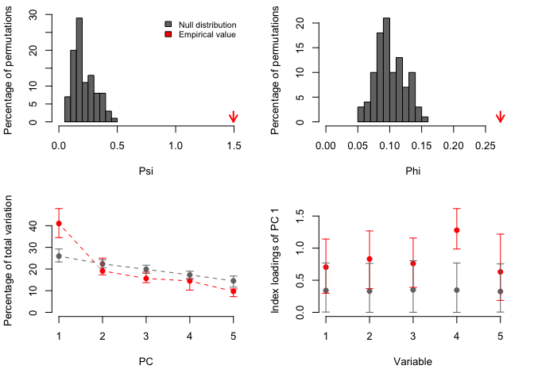

<!-- README.md is generated from README.Rmd. Please edit that file -->

# PCAtest

<!-- badges: start -->

<!-- badges: end -->

The goal of PCAtest is to evaluate the overall significance of a PCA, of
each PC axis, and of the contributions of each observed variable to the
significant axes based on permutation-based statistical tests.

## Installation

You can install the released version of PCAtest from
[CRAN](https://CRAN.R-project.org) with:

``` r
install.packages("PCAtest")
```

And the development version from [GitHub](https://github.com/) with:

``` r
# install.packages("devtools")
devtools::install_github("arleyc/PCAtest")
```

## Example

This is a basic example which shows you how to solve a common problem:

``` r
library(PCAtest)
# PCA analysis of two uncorrelated variables
v1<-runif(100,0,1)
v2<-runif(100,0,1)
x<-cbind(v1,v2)
result<-PCAtest(x, 100, 100, 0.05, corr=FALSE, plot=TRUE)
#>  1 of 100 bootstrap replicates 2 of 100 bootstrap replicates 3 of 100 bootstrap replicates 4 of 100 bootstrap replicates 5 of 100 bootstrap replicates 6 of 100 bootstrap replicates 7 of 100 bootstrap replicates 8 of 100 bootstrap replicates 9 of 100 bootstrap replicates 10 of 100 bootstrap replicates 11 of 100 bootstrap replicates 12 of 100 bootstrap replicates 13 of 100 bootstrap replicates 14 of 100 bootstrap replicates 15 of 100 bootstrap replicates 16 of 100 bootstrap replicates 17 of 100 bootstrap replicates 18 of 100 bootstrap replicates 19 of 100 bootstrap replicates 20 of 100 bootstrap replicates 21 of 100 bootstrap replicates 22 of 100 bootstrap replicates 23 of 100 bootstrap replicates 24 of 100 bootstrap replicates 25 of 100 bootstrap replicates 26 of 100 bootstrap replicates 27 of 100 bootstrap replicates 28 of 100 bootstrap replicates 29 of 100 bootstrap replicates 30 of 100 bootstrap replicates 31 of 100 bootstrap replicates 32 of 100 bootstrap replicates 33 of 100 bootstrap replicates 34 of 100 bootstrap replicates 35 of 100 bootstrap replicates 36 of 100 bootstrap replicates 37 of 100 bootstrap replicates 38 of 100 bootstrap replicates 39 of 100 bootstrap replicates 40 of 100 bootstrap replicates 41 of 100 bootstrap replicates 42 of 100 bootstrap replicates 43 of 100 bootstrap replicates 44 of 100 bootstrap replicates 45 of 100 bootstrap replicates 46 of 100 bootstrap replicates 47 of 100 bootstrap replicates 48 of 100 bootstrap replicates 49 of 100 bootstrap replicates 50 of 100 bootstrap replicates 51 of 100 bootstrap replicates 52 of 100 bootstrap replicates 53 of 100 bootstrap replicates 54 of 100 bootstrap replicates 55 of 100 bootstrap replicates 56 of 100 bootstrap replicates 57 of 100 bootstrap replicates 58 of 100 bootstrap replicates 59 of 100 bootstrap replicates 60 of 100 bootstrap replicates 61 of 100 bootstrap replicates 62 of 100 bootstrap replicates 63 of 100 bootstrap replicates 64 of 100 bootstrap replicates 65 of 100 bootstrap replicates 66 of 100 bootstrap replicates 67 of 100 bootstrap replicates 68 of 100 bootstrap replicates 69 of 100 bootstrap replicates 70 of 100 bootstrap replicates 71 of 100 bootstrap replicates 72 of 100 bootstrap replicates 73 of 100 bootstrap replicates 74 of 100 bootstrap replicates 75 of 100 bootstrap replicates 76 of 100 bootstrap replicates 77 of 100 bootstrap replicates 78 of 100 bootstrap replicates 79 of 100 bootstrap replicates 80 of 100 bootstrap replicates 81 of 100 bootstrap replicates 82 of 100 bootstrap replicates 83 of 100 bootstrap replicates 84 of 100 bootstrap replicates 85 of 100 bootstrap replicates 86 of 100 bootstrap replicates 87 of 100 bootstrap replicates 88 of 100 bootstrap replicates 89 of 100 bootstrap replicates 90 of 100 bootstrap replicates 91 of 100 bootstrap replicates 92 of 100 bootstrap replicates 93 of 100 bootstrap replicates 94 of 100 bootstrap replicates 95 of 100 bootstrap replicates 96 of 100 bootstrap replicates 97 of 100 bootstrap replicates 98 of 100 bootstrap replicates 99 of 100 bootstrap replicates 100 of 100 bootstrap replicatesCalculating confidence intervals of empirical statistics... Please wait 1 of 100 random permutations                                                  2 of 100 random permutations                                                  3 of 100 random permutations                                                  4 of 100 random permutations                                                  5 of 100 random permutations                                                  6 of 100 random permutations                                                  7 of 100 random permutations                                                  8 of 100 random permutations                                                  9 of 100 random permutations                                                  10 of 100 random permutations                                                  11 of 100 random permutations                                                  12 of 100 random permutations                                                  13 of 100 random permutations                                                  14 of 100 random permutations                                                  15 of 100 random permutations                                                  16 of 100 random permutations                                                  17 of 100 random permutations                                                  18 of 100 random permutations                                                  19 of 100 random permutations                                                  20 of 100 random permutations                                                  21 of 100 random permutations                                                  22 of 100 random permutations                                                  23 of 100 random permutations                                                  24 of 100 random permutations                                                  25 of 100 random permutations                                                  26 of 100 random permutations                                                  27 of 100 random permutations                                                  28 of 100 random permutations                                                  29 of 100 random permutations                                                  30 of 100 random permutations                                                  31 of 100 random permutations                                                  32 of 100 random permutations                                                  33 of 100 random permutations                                                  34 of 100 random permutations                                                  35 of 100 random permutations                                                  36 of 100 random permutations                                                  37 of 100 random permutations                                                  38 of 100 random permutations                                                  39 of 100 random permutations                                                  40 of 100 random permutations                                                  41 of 100 random permutations                                                  42 of 100 random permutations                                                  43 of 100 random permutations                                                  44 of 100 random permutations                                                  45 of 100 random permutations                                                  46 of 100 random permutations                                                  47 of 100 random permutations                                                  48 of 100 random permutations                                                  49 of 100 random permutations                                                  50 of 100 random permutations                                                  51 of 100 random permutations                                                  52 of 100 random permutations                                                  53 of 100 random permutations                                                  54 of 100 random permutations                                                  55 of 100 random permutations                                                  56 of 100 random permutations                                                  57 of 100 random permutations                                                  58 of 100 random permutations                                                  59 of 100 random permutations                                                  60 of 100 random permutations                                                  61 of 100 random permutations                                                  62 of 100 random permutations                                                  63 of 100 random permutations                                                  64 of 100 random permutations                                                  65 of 100 random permutations                                                  66 of 100 random permutations                                                  67 of 100 random permutations                                                  68 of 100 random permutations                                                  69 of 100 random permutations                                                  70 of 100 random permutations                                                  71 of 100 random permutations                                                  72 of 100 random permutations                                                  73 of 100 random permutations                                                  74 of 100 random permutations                                                  75 of 100 random permutations                                                  76 of 100 random permutations                                                  77 of 100 random permutations                                                  78 of 100 random permutations                                                  79 of 100 random permutations                                                  80 of 100 random permutations                                                  81 of 100 random permutations                                                  82 of 100 random permutations                                                  83 of 100 random permutations                                                  84 of 100 random permutations                                                  85 of 100 random permutations                                                  86 of 100 random permutations                                                  87 of 100 random permutations                                                  88 of 100 random permutations                                                  89 of 100 random permutations                                                  90 of 100 random permutations                                                  91 of 100 random permutations                                                  92 of 100 random permutations                                                  93 of 100 random permutations                                                  94 of 100 random permutations                                                  95 of 100 random permutations                                                  96 of 100 random permutations                                                  97 of 100 random permutations                                                  98 of 100 random permutations                                                  99 of 100 random permutations                                                  100 of 100 random permutations                                                 Comparing empirical statistics with their null distributions... Please wait
#> ========================================================
#> Test of PCA significance: 2 variables, 100 observations
#> 100 bootstrap replicates, 100 random permutations
#> ========================================================
#> 
#> Empirical Psi = 0.0087, Max null Psi = 0.1215, Min null Psi = 0.0000, p-value = 0.48
#> Empirical Phi = 0.0661, Max null Phi = 0.2465, Min null Phi = 0.0014, p-value = 0.48
```


``` r
#PCA analysis of two fully-correlated variables
v1<-seq(0,1,0.01)
v2<-seq(0,1,0.01)
x<-cbind(v1,v2)
PCAout<-PCAtest(x, 100, 100, 0.05, corr=FALSE, plot=TRUE)
#>  1 of 100 bootstrap replicates 2 of 100 bootstrap replicates 3 of 100 bootstrap replicates 4 of 100 bootstrap replicates 5 of 100 bootstrap replicates 6 of 100 bootstrap replicates 7 of 100 bootstrap replicates 8 of 100 bootstrap replicates 9 of 100 bootstrap replicates 10 of 100 bootstrap replicates 11 of 100 bootstrap replicates 12 of 100 bootstrap replicates 13 of 100 bootstrap replicates 14 of 100 bootstrap replicates 15 of 100 bootstrap replicates 16 of 100 bootstrap replicates 17 of 100 bootstrap replicates 18 of 100 bootstrap replicates 19 of 100 bootstrap replicates 20 of 100 bootstrap replicates 21 of 100 bootstrap replicates 22 of 100 bootstrap replicates 23 of 100 bootstrap replicates 24 of 100 bootstrap replicates 25 of 100 bootstrap replicates 26 of 100 bootstrap replicates 27 of 100 bootstrap replicates 28 of 100 bootstrap replicates 29 of 100 bootstrap replicates 30 of 100 bootstrap replicates 31 of 100 bootstrap replicates 32 of 100 bootstrap replicates 33 of 100 bootstrap replicates 34 of 100 bootstrap replicates 35 of 100 bootstrap replicates 36 of 100 bootstrap replicates 37 of 100 bootstrap replicates 38 of 100 bootstrap replicates 39 of 100 bootstrap replicates 40 of 100 bootstrap replicates 41 of 100 bootstrap replicates 42 of 100 bootstrap replicates 43 of 100 bootstrap replicates 44 of 100 bootstrap replicates 45 of 100 bootstrap replicates 46 of 100 bootstrap replicates 47 of 100 bootstrap replicates 48 of 100 bootstrap replicates 49 of 100 bootstrap replicates 50 of 100 bootstrap replicates 51 of 100 bootstrap replicates 52 of 100 bootstrap replicates 53 of 100 bootstrap replicates 54 of 100 bootstrap replicates 55 of 100 bootstrap replicates 56 of 100 bootstrap replicates 57 of 100 bootstrap replicates 58 of 100 bootstrap replicates 59 of 100 bootstrap replicates 60 of 100 bootstrap replicates 61 of 100 bootstrap replicates 62 of 100 bootstrap replicates 63 of 100 bootstrap replicates 64 of 100 bootstrap replicates 65 of 100 bootstrap replicates 66 of 100 bootstrap replicates 67 of 100 bootstrap replicates 68 of 100 bootstrap replicates 69 of 100 bootstrap replicates 70 of 100 bootstrap replicates 71 of 100 bootstrap replicates 72 of 100 bootstrap replicates 73 of 100 bootstrap replicates 74 of 100 bootstrap replicates 75 of 100 bootstrap replicates 76 of 100 bootstrap replicates 77 of 100 bootstrap replicates 78 of 100 bootstrap replicates 79 of 100 bootstrap replicates 80 of 100 bootstrap replicates 81 of 100 bootstrap replicates 82 of 100 bootstrap replicates 83 of 100 bootstrap replicates 84 of 100 bootstrap replicates 85 of 100 bootstrap replicates 86 of 100 bootstrap replicates 87 of 100 bootstrap replicates 88 of 100 bootstrap replicates 89 of 100 bootstrap replicates 90 of 100 bootstrap replicates 91 of 100 bootstrap replicates 92 of 100 bootstrap replicates 93 of 100 bootstrap replicates 94 of 100 bootstrap replicates 95 of 100 bootstrap replicates 96 of 100 bootstrap replicates 97 of 100 bootstrap replicates 98 of 100 bootstrap replicates 99 of 100 bootstrap replicates 100 of 100 bootstrap replicatesCalculating confidence intervals of empirical statistics... Please wait 1 of 100 random permutations                                                  2 of 100 random permutations                                                  3 of 100 random permutations                                                  4 of 100 random permutations                                                  5 of 100 random permutations                                                  6 of 100 random permutations                                                  7 of 100 random permutations                                                  8 of 100 random permutations                                                  9 of 100 random permutations                                                  10 of 100 random permutations                                                  11 of 100 random permutations                                                  12 of 100 random permutations                                                  13 of 100 random permutations                                                  14 of 100 random permutations                                                  15 of 100 random permutations                                                  16 of 100 random permutations                                                  17 of 100 random permutations                                                  18 of 100 random permutations                                                  19 of 100 random permutations                                                  20 of 100 random permutations                                                  21 of 100 random permutations                                                  22 of 100 random permutations                                                  23 of 100 random permutations                                                  24 of 100 random permutations                                                  25 of 100 random permutations                                                  26 of 100 random permutations                                                  27 of 100 random permutations                                                  28 of 100 random permutations                                                  29 of 100 random permutations                                                  30 of 100 random permutations                                                  31 of 100 random permutations                                                  32 of 100 random permutations                                                  33 of 100 random permutations                                                  34 of 100 random permutations                                                  35 of 100 random permutations                                                  36 of 100 random permutations                                                  37 of 100 random permutations                                                  38 of 100 random permutations                                                  39 of 100 random permutations                                                  40 of 100 random permutations                                                  41 of 100 random permutations                                                  42 of 100 random permutations                                                  43 of 100 random permutations                                                  44 of 100 random permutations                                                  45 of 100 random permutations                                                  46 of 100 random permutations                                                  47 of 100 random permutations                                                  48 of 100 random permutations                                                  49 of 100 random permutations                                                  50 of 100 random permutations                                                  51 of 100 random permutations                                                  52 of 100 random permutations                                                  53 of 100 random permutations                                                  54 of 100 random permutations                                                  55 of 100 random permutations                                                  56 of 100 random permutations                                                  57 of 100 random permutations                                                  58 of 100 random permutations                                                  59 of 100 random permutations                                                  60 of 100 random permutations                                                  61 of 100 random permutations                                                  62 of 100 random permutations                                                  63 of 100 random permutations                                                  64 of 100 random permutations                                                  65 of 100 random permutations                                                  66 of 100 random permutations                                                  67 of 100 random permutations                                                  68 of 100 random permutations                                                  69 of 100 random permutations                                                  70 of 100 random permutations                                                  71 of 100 random permutations                                                  72 of 100 random permutations                                                  73 of 100 random permutations                                                  74 of 100 random permutations                                                  75 of 100 random permutations                                                  76 of 100 random permutations                                                  77 of 100 random permutations                                                  78 of 100 random permutations                                                  79 of 100 random permutations                                                  80 of 100 random permutations                                                  81 of 100 random permutations                                                  82 of 100 random permutations                                                  83 of 100 random permutations                                                  84 of 100 random permutations                                                  85 of 100 random permutations                                                  86 of 100 random permutations                                                  87 of 100 random permutations                                                  88 of 100 random permutations                                                  89 of 100 random permutations                                                  90 of 100 random permutations                                                  91 of 100 random permutations                                                  92 of 100 random permutations                                                  93 of 100 random permutations                                                  94 of 100 random permutations                                                  95 of 100 random permutations                                                  96 of 100 random permutations                                                  97 of 100 random permutations                                                  98 of 100 random permutations                                                  99 of 100 random permutations                                                  100 of 100 random permutations                                                 Comparing empirical statistics with their null distributions... Please wait
#> ========================================================
#> Test of PCA significance: 2 variables, 101 observations
#> 100 bootstrap replicates, 100 random permutations
#> ========================================================
#> 
#> Empirical Psi = 2.0000, Max null Psi = 0.1946, Min null Psi = 0.0000, p-value = 0
#> Empirical Phi = 1.0000, Max null Phi = 0.3119, Min null Phi = 0.0020, p-value = 0
#> 
#> Empirical eigenvalue #1 = 2, Max null eigenvalue = 1.31192, p-value = 0
#> Empirical eigenvalue #2 = 0, Max null eigenvalue = 0.99798, p-value = 1
#> 
#> PC 1 is significant and accounts for 100% (95%-CI:100-100) of the total variation
#> 
#> Variables 1, and 2 have significant loadings on PC 1
```



What is special about using `README.Rmd` instead of just `README.md`?
You can include R chunks like so:

``` r
summary(cars)
#>      speed           dist       
#>  Min.   : 4.0   Min.   :  2.00  
#>  1st Qu.:12.0   1st Qu.: 26.00  
#>  Median :15.0   Median : 36.00  
#>  Mean   :15.4   Mean   : 42.98  
#>  3rd Qu.:19.0   3rd Qu.: 56.00  
#>  Max.   :25.0   Max.   :120.00
```

You’ll still need to render `README.Rmd` regularly, to keep `README.md`
up-to-date. `devtools::build_readme()` is handy for this. You could also
use GitHub Actions to re-render `README.Rmd` every time you push. An
example workflow can be found here:
<https://github.com/r-lib/actions/tree/master/examples>.

You can also embed plots, for example:


In that case, don’t forget to commit and push the resulting figure
files, so they display on GitHub and CRAN.
